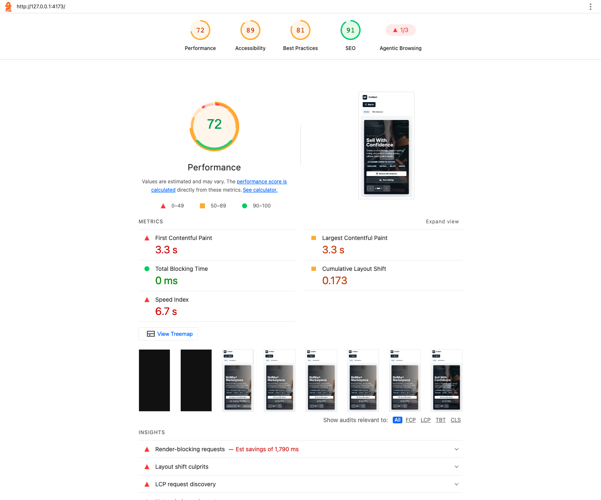
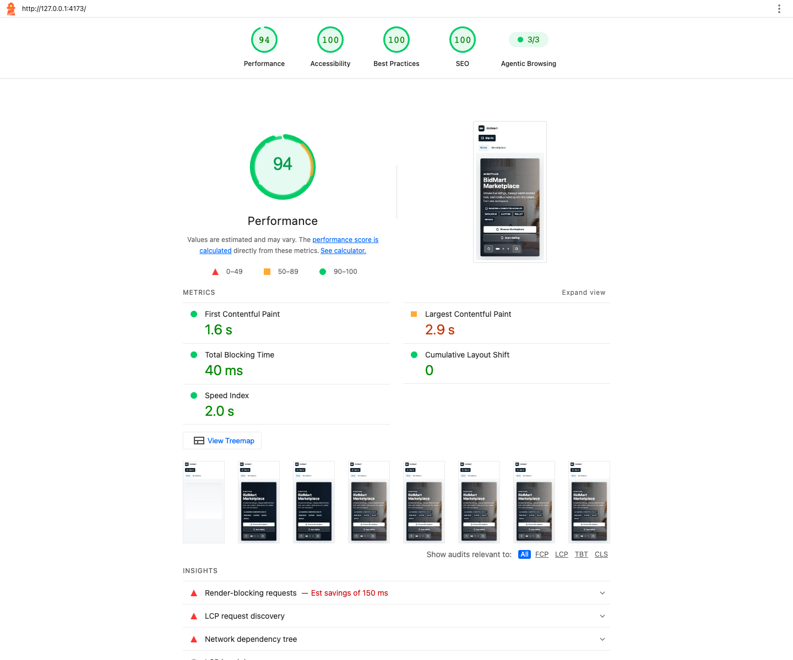

# Software Quality

## Quality Gates

| Gate | Command | Purpose |
|------|---------|---------|
| Lint | `npm run lint` | ESLint 9 static analysis |
| Contract tests | `npm test` | Gateway/API shape and frontend flow contracts |
| Build | `npm run build` | TypeScript project build and Vite production bundle |
| E2E smoke | `npm run test:e2e:smoke` | Auth/profile and wallet smoke paths |
| Full E2E | `npm run test:e2e` | Playwright journeys against a running stack |
| Lighthouse | `npm run lighthouse:home -- http://127.0.0.1:4173/ artifacts lighthouse-marketplace-home` | Production-preview UX/performance audit |

## Contract and E2E Coverage

| Suite | Coverage |
|-------|----------|
| `frontend-flow.contract.test.mjs` | Authenticated context, marketplace, lifecycle calls, realtime notification expectations |
| `*.contract.test.mjs` | Nginx proxy, loading states, seller route gating |
| `e2e/auth-profile.spec.ts` | Register/login/profile journey |
| `e2e/wallet.spec.ts` | Wallet top-up and pending payment UX |
| `e2e/auction-war.spec.ts` | Concurrent bidding UI |
| `e2e/auction-win.spec.ts` | Auction win to order |
| `e2e/order-dispute.spec.ts` | Dispute journey |

## Lighthouse Evidence

Latest evidence uses the newest local production-preview run, with filename timestamps normalized to **2026-05-22**.

| Category | Before | After |
|----------|--------|-------|
| Performance | 72 | 94 |
| Accessibility | 89 | 100 |
| Best Practices | 81 | 100 |
| SEO | 91 | 100 |
| Agentic Browsing | 1/3 | 3/3 |
| First Contentful Paint | 3.3 s | 1.6 s |
| Largest Contentful Paint | 3.3 s | 2.9 s |
| Cumulative Layout Shift | 0.173 | 0 |

Before:

After:

## Evidence Files

| File | Meaning |
|------|---------|
| `docs/evidence/lighthouse-before-2026-05-22.png` | Latest Lighthouse before screenshot |
| `docs/evidence/lighthouse-after-2026-05-22.png` | Latest Lighthouse after screenshot |
| `docs/evidence/sonar-quality-gate-2026-05-21.png` | Sonar quality gate proof |
| `docs/evidence/ci-workflow-success-2026-05-21.png` | CI gate proof |
| `docs/evidence/playwright-report-2026-05-21.png` | Playwright report proof |

## Security and Reliability Checks

- JWT is attached through API adapters and not passed through URL query strings.
- STOMP CONNECT uses `Authorization: Bearer <access_token>`.
- Admin routes use frontend role guards; backend RBAC remains authoritative.
- Push service worker is scoped to the application origin.
- React Query and realtime patches reduce repeated network requests and stale UI state.
- Websocket libraries are lazy-loaded only for authenticated subscriptions.
