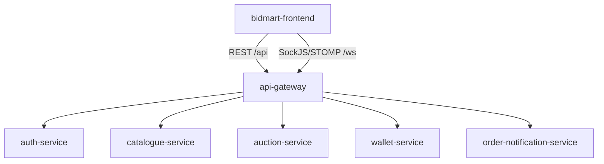

# Software Architecture

## Role in BidMart

The frontend is the SPA shell for all BidMart user journeys. It does not call backend services directly; REST and websocket traffic goes through the API gateway.

## API Surface Consumed

| Backend module | Gateway endpoints used by frontend |
|----------------|------------------------------------|
| Auth | `/api/v1/auth/login`, register, refresh, logout, OAuth, 2FA, profile, sessions |
| Catalogue | `/api/v1/catalogue/listings/search`, listing CRUD, publish, deactivate, cancel |
| Auction | `/api/v1/listings`, `/api/v1/listings/{id}/bids`, bid cursor, proxy bid, close |
| Wallet | `/api/v1/wallet/{userId}`, top-up intent, payment detail, withdraw, transaction history |
| Order/notification | `/api/v1/orders`, dispute endpoints, `/api/v1/notifications` |
| Realtime | `/ws/notifications`, auction topics, user notification queue |

Implementation entry points:

- Base URL and proxy: `src/config/api.ts`, Vite proxy configuration.
- Authenticated calls: auth/catalogue/auction/wallet/order API utilities.
- Realtime: `src/hooks/useWebSocket.ts` and notification/auction hooks.

## State Architecture

| State type | Tooling | Usage |
|------------|---------|-------|
| Server state | `@tanstack/react-query` | Listings, listing detail, bids, wallet, orders |
| Session state | `AuthContext` | User, roles, token refresh, session revocation |
| Realtime state | STOMP hooks | Notification events and auction patches |
| UI state | React state/context | Wallet modal, toast, carousel, forms |

## Key Workflows

| Journey | Frontend entry | Backend modules |
|---------|----------------|-----------------|
| Browse marketplace | `/`, `/marketplace` | catalogue, auction summaries |
| Sell listing | `/seller-studio` | catalogue + auction session open |
| Bid | `/listings/:id` | auction + wallet hold |
| Auction win to order | listing/order pages | auction, RabbitMQ, order service |
| Wallet top-up | `/wallet` | wallet + payment gateway integration |
| Dispute | `/orders/:orderId` | order + wallet settlement/refund |
| Admin | `/admin/studio/*` | auth, catalogue, order |

## Non-Functional Architecture

| Concern | Decision |
|---------|----------|
| Performance | Route-level lazy loading, dynamic websocket imports, image loading controls, React Query caching |
| Accessibility | Visible focus rings, labelled icon buttons, touch targets, sufficient contrast |
| Reliability | Contract tests plus Playwright journeys against the gateway |
| Scalability | Static assets are CDN/edge friendly; websocket capacity belongs to gateway/order-notification |
| Observability | Lighthouse and Playwright evidence for frontend UX; backend metrics handled by infrastructure dashboards |

## Boundaries

- Frontend only renders and submits user intent.
- Backend services remain source of truth for validation, permissions, wallet balances, auction outcome, and order settlement.
- Client-side guards improve UX but do not replace backend authorization.
