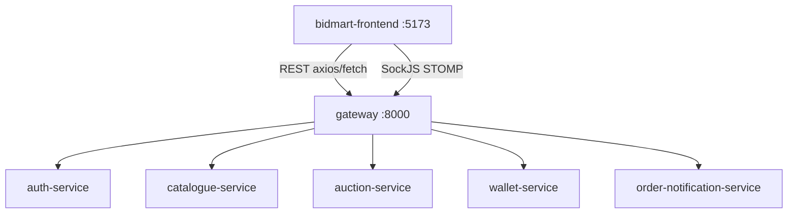

# Software Architecture

## Role in the platform

The frontend is the **single-page application shell** for all buyer/seller/admin journeys. It never calls microservices directly; all REST and WebSocket traffic goes through the API gateway.

## API access

| Concern | Implementation |
|---------|----------------|
| Base URL | `import.meta.env.VITE_API_BASE_URL` (see [`.env.example`](../.env.example)) |
| Auth headers | `src/modules/auth/utils/auth-api.ts` attaches Bearer JWT |
| Module endpoints | `src/modules/catalogue/api/endpoints.ts`, auction/wallet/order utils |

## State management

| Layer | Technology | Usage |
|-------|------------|--------|
| Server state | `@tanstack/react-query` | Listings, auctions, orders, wallet balance |
| Session | `AuthContext` | User, roles, token refresh |
| Realtime | STOMP hooks | Patch auction/order caches without full reload |
| UI modal | `WalletUIContext` | Top-up flow overlay |

## Realtime architecture

1. **Auction public topics** — price/high-bidder patches merged via `auction-realtime-patch.ts` into React Query cache.
2. **Private notifications** — `useNotificationRealtime.ts` subscribes per user; deep links to order/listing routes.
3. **Security** — CONNECT frame sends `Authorization: Bearer`; see [11. Keamanan stomp.md](../../bidmart-order-and-notification-service/docs/11. Keamanan stomp.md).

## Key user journeys

| Journey | Frontend entry | Backend modules |
|---------|----------------|-----------------|
| Sell → auction | `SellPage.tsx` | catalogue + auction |
| Bid war | `ListingDetailPage` + STOMP | auction + wallet hold |
| Win → order | `auction-win` E2E | order `auction-won` consumer |
| Dispute | `OrderDetailPage.tsx` | order dispute APIs |
| Wallet top-up | `WalletPage.tsx` | wallet + Midtrans redirect |
| Admin RBAC | `AdminAuthPage.tsx` | auth permissions |

## Deployment artifact

- `npm run build` → static `dist/`
- [`Dockerfile`](../Dockerfile) — Node build + `serve` for preview/production
- Compose: service `frontend` with volume mount for dev

## Observability (client)

- No Prometheus scrape on the SPA itself.
- UX performance: **Lighthouse** artifacts under `artifacts/`
- Functional proof: **Playwright** HTML report + CI artifact `playwright-html-report`

## Related platform docs

- [bidmart-infrastructure/docs/Context.md](../../bidmart-infrastructure/docs/Context.md)
- [bidmart-infrastructure/docs/adr/ADR-003-identity-gateway.md](../../bidmart-infrastructure/docs/adr/ADR-003-identity-gateway.md)
